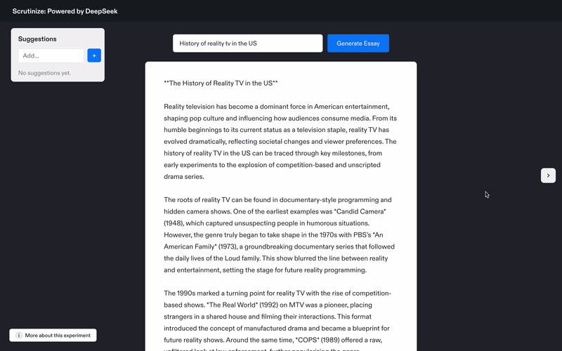

# Scrutinize

Scrutinize is an experimental document analysis and annotation tool designed to help you analyze and improve your writing through AI-powered insights and interactive annotations. The tool uses DeepSeek's model to generate essays and provides a sophisticated document viewer with annotation capabilities, allowing you to mark up text, add notes, and track your analysis—all while maintaining a clean and modern interface.

<p align="center">
  
</p>

## Prerequisites

Before you begin, ensure you have the following installed:

- Node.js (v18 or later)
- npm (v9 or later)

## Local Development

1. Clone the repository:
```bash
git clone https://github.com/yourusername/scrutinize.git
cd scrutinize
```

2. Install dependencies:
```bash
npm install
```

3. Create .env.local file and add API key:
```bash
REACT_APP_DEEPSEEK_API_KEY=your_api_key_here
```

You can also optionally gate access to the app behind a simple global password:

```
REACT_APP_PASSWORD_GATE_SECRET=your_shared_password_here
```

This is a frontend-only access gate intended for light protection (for example, to keep casual visitors out of a demo). It does **not** provide strong security—determined users can still inspect client-side code and network traffic.

4. Start the development server:
```bash
npm start
```

5. Open `http://localhost:3000` in your browser to see the application.

## Available Scripts

- `npm start` - Start the development server
- `npm run build` - Build the application for production
- `npm test` - Run the test suite
- `npm run eject` - Eject from Create React App (one-way operation)
